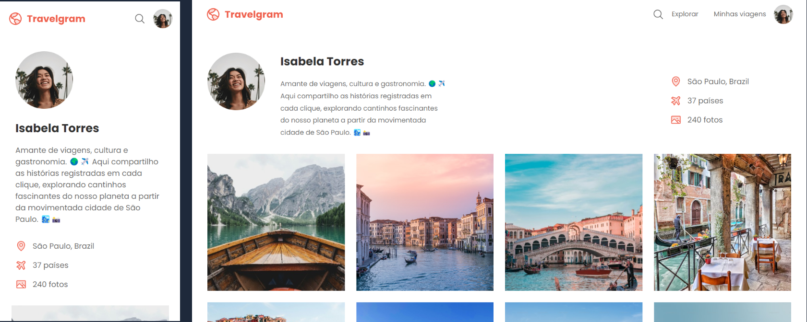

# 💻 Travelgram

Este projeto tem como objetivo criar um perfil de rede social para registrar fotos de viagens para praticar e aprimorar fundamentos de **Responsividade**, **HTML** e **CSS**.

---

## 🚀 Tecnologias Utilizadas
- 
- 

---

## 📌 Layout
O layout deste projeto foi baseado em um design do [Figma](https://www.figma.com/design/zxL7Df4NEnHPomq2B61eBU/Perfil-de-viagens--Community-?node-id=0-1&p=f&t=1G9aXaxdKkH7g3HR-0) 🌟